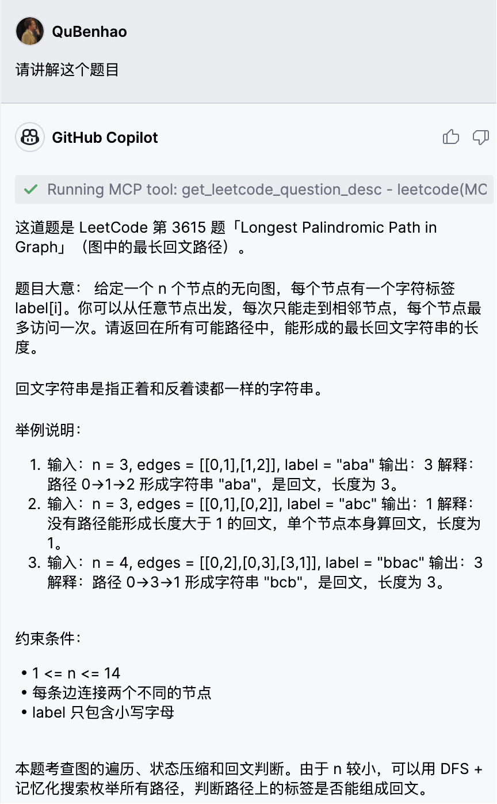
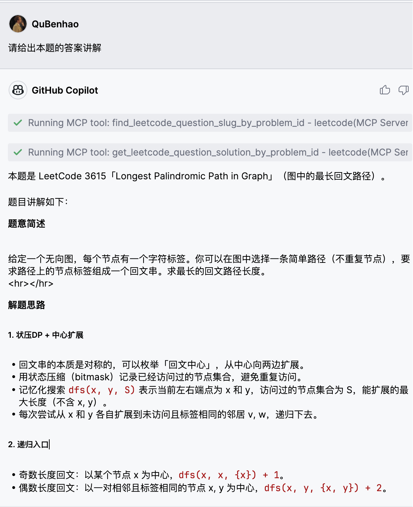
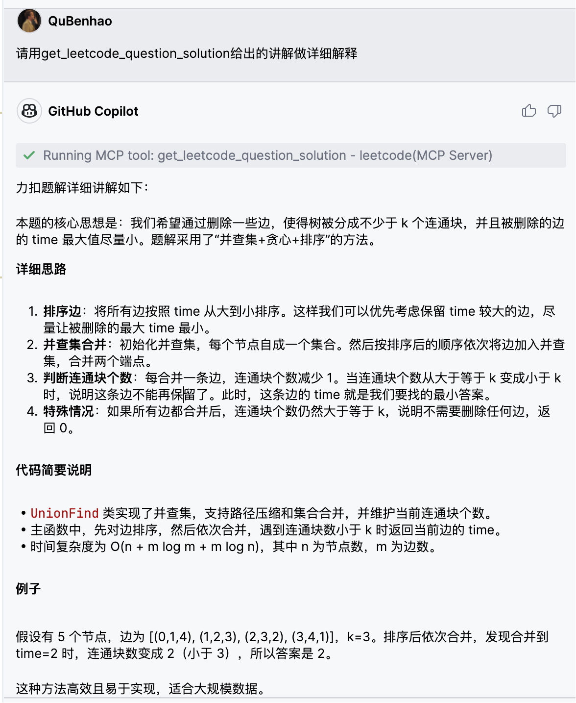

# LeetCodeMCP
LeetCodeMCP

# config

修改下面的路径到你拉下来的路径就可以用了。
语言如果常用英语的话可以把`LANGUAGE` 改成 `en-US`。
```mcp.json
{
    "servers": {
        "leetcode": {
            "type": "stdio",
            "command": "uv",
            "args": [
                "run",
                "--with",
                "mcp[cli]",
                "mcp",
                "run",
                "/path/to/leetcodemcp/main.py"
            ],
            "env": {
                "LANGUAGE": "zh-CN"
            }
        }
    }
}
```


# DEMO Usage





